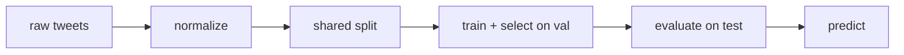
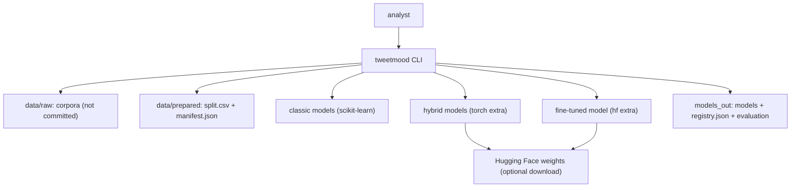
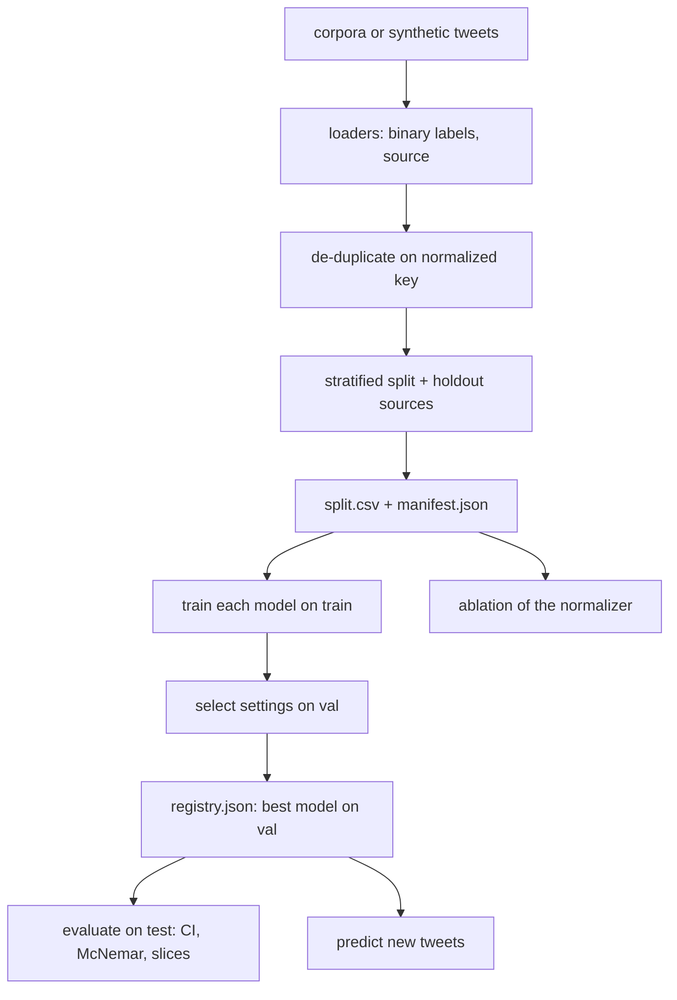

<div align="center">

# tweetmood — Negation-Safe, Slang-Aware Tweet Sentiment

**tweetmood is a tweet sentiment toolkit that compares classic and hybrid neural models fairly. It takes raw tweets through these steps to a positive or negative label from the model that won on validation:**

`normalize` → `de-duplicate` → `shared split` → `train` → `select on validation` → `evaluate once` → `predict`.


**[Summary](#1-summary)** ·
**[Workflow](#4-the-end-to-end-workflow)** ·
**[Run it](#10-how-to-run-tweetmood)** ·
**[Configuration](#104-environment-variables)** ·
**[Known problems](#13-known-problems)** ·
**[Glossary](#15-glossary)**

</div>

> [!NOTE]
> This README uses ASD-STE100 Simplified Technical English. The writing rules and the project
> vocabulary are in [`docs/ste-style-guide.md`](docs/ste-style-guide.md). Each term in the
> [Glossary](#15-glossary) has only one meaning.

> [!WARNING]
> Do not use tweetmood to moderate, rank or judge people. Sentiment labels from tweets carry the bias
> of the corpora and of their annotators. A person must review every decision that uses these labels.

---

tweetmood labels tweets as negative or positive. One normalizer keeps negations, names emoji and emoticons, splits hashtags and expands Gen-Z slang into plain English. Every model, from a word lexicon to a fine-tuned Twitter transformer, reads the same shared split and the same normalizer. The best model is selected on validation and then evaluated on the test split one time.

This README is the **one location that explains all of tweetmood**. It gives these topics:

- the general design
- each component and its procedure, step by step
- the decision rules
- the data map
- the runbook
- the validation results and the known problems

| If you are… | Read |
|---|---|
| A manager or reviewer | [1](#1-summary), [3](#3-design-rules), [4](#4-the-end-to-end-workflow), [12](#12-validation-results), [14](#14-key-points) |
| A developer who joins the project | All sections, in sequence. Keep [10](#10-how-to-run-tweetmood) and [13](#13-known-problems) open while you work |
| An operator who runs tweetmood | [10](#10-how-to-run-tweetmood), then the section for the component that you use |

---

## Table of contents

1. 🧭 [Summary](#1-summary)
2. 🏗️ [How tweetmood is built](#2-how-tweetmood-is-built)
   - 2.1 [Components](#21-components)
   - 2.2 [System context](#22-system-context)
   - 2.3 [Repository layout](#23-repository-layout)
3. 🛡️ [Design rules](#3-design-rules)
4. 🔄 [The end-to-end workflow](#4-the-end-to-end-workflow)
   - 4.1 [Full flow](#41-full-flow)
   - 4.2 [The life cycle of one tweet](#42-the-life-cycle-of-one-tweet)
5. 🔵 [The normalizer](#5-the-normalizer)
6. 🟢 [The data and the shared split](#6-the-data-and-the-shared-split)
7. 🟣 [The models](#7-the-models)
8. ⚖️ [Selection, evaluation and the ablation](#8-selection-evaluation-and-the-ablation)
9. 🗂️ [Data and file map](#9-data-and-file-map)
10. ▶️ [How to run tweetmood](#10-how-to-run-tweetmood)
    - 10.1 [Prerequisites](#101-prerequisites) · 10.2 [Installation](#102-installation) · 10.3 [Run tweetmood](#103-run-tweetmood) · 10.4 [Environment variables](#104-environment-variables)
11. 🧩 [How to extend tweetmood](#11-how-to-extend-tweetmood)
12. ✅ [Validation results](#12-validation-results)
13. ⚠️ [Known problems](#13-known-problems)
14. 📌 [Key points](#14-key-points)
15. 📖 [Glossary](#15-glossary)
16. 📄 [License](#16-license)

---

## 1. Summary

**The problem.** Tweet sentiment comparisons often look fair but are not. The difficult questions are:

- Do the neural models and the classic models use the same test tweets?
- Does the text cleaning delete "not", "no" and "never" before the model sees them?
- Does an emoticon such as `:D` survive the cleaning, and does an emoji name stay one token?
- Can a model read new slang such as "mid" or "bussin" if its training data is from 2009?
- Is the best model selected on validation, from the models that were trained in the run?
- Does the prediction path use the same normalization as the training path?

tweetmood gives each of these questions its own component and its own tests.

| Item | Value |
|---|---|
| Input | Tweets from Sentiment140, TweetEval, a small recent social-media set, or a unified CSV |
| Output | A shared split, trained models, a registry, a test report with slices, labels for new tweets |
| Components | **6**: normalizer, loaders and shared split, classic models, hybrid models, fine-tuned model, workflow |
| Providers | Hugging Face Transformers for the `hf` embedder and the fine-tuned model. Optional |
| Offline mode | Synthetic tweets, the normalizer, the lexicon and TF-IDF models, the hybrid models with the `hash` embedder (torch), evaluation, prediction |
| Safety | One shared split with a fingerprint, selection on validation only, no stop-word removal, normalizer inside every model |
| Tests | **34** unit tests (`pytest`). In CI without torch, 29 pass and the torch module (5 tests) skips |



---

## 2. How tweetmood is built

### 2.1 Components

| Component | Module | Purpose |
|---|---|---|
| Maps | `src/tweetmood/text/lexicon.py` | Emoticons, slang map, negation contractions, negators |
| Normalizer | `src/tweetmood/text/normalize.py` | The one text function, negation scope, slice detectors |
| Loaders | `src/tweetmood/data/loaders.py` | Sentiment140, TweetEval, social set, unified CSV. Schema check |
| Shared split | `src/tweetmood/data/split.py` | De-duplication, stratified split, holdout sources, fingerprint |
| Synthetic tweets | `src/tweetmood/data/synthetic.py` | Classic and Gen-Z sources for the demo and the tests |
| Model interface | `src/tweetmood/models/base.py` | `fit`, `predict_proba`, `save`, `load` and the factory |
| Lexicon model | `src/tweetmood/models/lexicon.py` | Word polarities, negation flips, threshold fit on train |
| TF-IDF models | `src/tweetmood/models/linear.py` | Sparse pipelines: normalizer, TF-IDF, classifier |
| Hybrid models | `src/tweetmood/models/hybrid.py` | Frozen embedder plus a BiLSTM or transformer head (torch) |
| Fine-tuned model | `src/tweetmood/models/finetune.py` | Full fine-tuning of a Twitter transformer (torch, transformers) |
| Metrics | `src/tweetmood/evaluate.py` | Macro-F1, bootstrap interval, ROC-AUC, McNemar test, slices |
| Workflow | `src/tweetmood/workflow.py` | Train, registry, evaluation, prediction, ablation |
| Settings | `src/tweetmood/config.py` | Settings from environment variables |
| CLI | `src/tweetmood/cli.py` | The `tweetmood` command |

### 2.2 System context



### 2.3 Repository layout

```
tweetmood/
├── data/README.md               corpora, licenses, download, file schema
├── docs/ste-style-guide.md      writing rules and project vocabulary
├── src/tweetmood/
│   ├── text/                    maps (lexicon.py) and the normalizer
│   ├── data/                    loaders, shared split, synthetic tweets
│   ├── models/                  interface, lexicon, TF-IDF, hybrid, fine-tune
│   ├── evaluate.py              metrics, intervals, McNemar, slices
│   ├── workflow.py              train, registry, evaluate, predict, ablation
│   ├── config.py                settings from environment variables
│   └── cli.py                   the tweetmood command
├── tests/                       pytest suite
└── pyproject.toml               package, extras and the console script
```

---

## 3. Design rules

### 3.1 One shared split
`prepare` writes `split.csv` one time. Every command reads it and checks its fingerprint. The registry stores the fingerprint, and `evaluate` refuses models from another split.

### 3.2 Negations are never removed
The normalizer has no stop list. It expands `dont` to `do not` and `isn't` to `is not`. For the TF-IDF and lexicon models, it marks up to three words after a negator with `NEG_`.

### 3.3 Case-sensitive steps come first
The normalizer maps emoticons and the letters `W` and `L` before it lower-cases the text. Emoji names keep their underscores, so `emoji_face_with_tears_of_joy` is one token.

### 3.4 One normalizer in every model
Each model calls the normalizer itself. In a TF-IDF model it is the first pipeline step. The saved model carries the normalizer settings, so `predict` uses the same steps as `train`.

### 3.5 Selection on validation, test one time
Each model selects its settings on `val`. The registry selects the best model on `val` macro-F1 among the models that you trained. `evaluate` scores the test split one time.

### 3.6 Sparse features only
The TF-IDF matrix stays sparse from the vectorizer to the classifier. No step calls `.toarray()`.

### 3.7 The right learning rate for a frozen encoder
A hybrid model trains only its head, so it uses a head learning rate of 1e-3, up to 15 epochs and early stopping. The fine-tuned model trains all weights with 2e-5.

---

## 4. The end-to-end workflow

### 4.1 Full flow



### 4.2 The life cycle of one tweet

1. The loader reads the tweet and its label, and adds the source name.
2. The splitter makes the de-duplication key from the normalized text.
3. The splitter puts the tweet in `train`, `val` or `test`.
4. During training, the model normalizes the tweet and turns it into features.
5. After the selection, `evaluate` scores the tweet if it is in the test split.
6. The slice detectors tag the tweet: negator, slang, emoji or emoticon, source.
7. At prediction time, the best model normalizes a new tweet with the same steps.
8. The model returns the label and the probability of `positive`.

---

## 5. The normalizer

**Purpose.** Give every model the same text, with the sentiment signal kept.

| Input | Output |
|---|---|
| A raw tweet | One string of space-separated tokens |

**Procedure**

1. Decode HTML entities. Replace URLs with `url` and mentions with `@user`.
2. Map emoticons, for example `:D` → `emo_laugh` and `</3` → `emo_broken_heart`.
3. Map an upper-case `W` to `win` and `L` to `loss`.
4. Name each emoji, for example 🔥 → `emoji_fire`. Remove skin-tone modifiers and joiners.
5. Split each hashtag, for example `#NoCap` → `no cap`.
6. Lower-case the text.
7. Expand negation contractions, for example `aint` → `is not`.
8. Shorten letter runs to two letters, for example `soooo` → `soo`.
9. Expand slang with one compiled pattern, for example `mid` → `mediocre`.
10. If `negation_scope` is on, mark up to three words after a negator with `NEG_`.

**Rules**

- The emoticon map has 37 entries. The slang map has 79 phrases. The contraction map has 32 forms.
- Only a slang term that is a real negation expands to a negator (`idk`, `idc`, `w/o`). Emphasis terms such as `no cap` and `ngl` expand to `honestly`, so they cannot start a false negation scope.
- The normalizer normalizes 5000 tweets in less than 5 seconds (a test checks it).

| Flag | Default | Effect when off |
|---|---|---|
| `emoticons` | on | Text faces stay as characters |
| `emoji` | on | Emoji stay as characters |
| `hashtags` | on | `#NoCap` stays one token |
| `slang` | on | Slang terms and `W` and `L` stay as they are |
| `elongation` | on | Letter runs stay |
| `negation_scope` | off | No `NEG_` marks (the TF-IDF and lexicon models turn it on) |

---

## 6. The data and the shared split

**Purpose.** Give all models the same de-duplicated split, with each source visible.

| Input | Output |
|---|---|
| `KIND=PATH` sources | `split.csv` with `id, text, label, source, split` and `manifest.json` |

**Procedure**

1. Load each source. Keep only binary labels. Count each dropped row by reason.
2. For Sentiment140, remove exact duplicates and take a balanced sample without replacement.
3. Make the key of each tweet: the normalized text without mentions, URLs and punctuation.
4. If copies of a key have two labels, remove all copies. Else keep one copy.
5. Put each holdout source in the test split.
6. Split the other tweets 70 / 10 / 20, stratified by label and source.
7. Write the split and the manifest with the fingerprint.

**Rules**

- The id of a tweet is a hash of its key. The same tweet gets the same id in each run.
- `load_split` refuses a split file that does not match its fingerprint.
- The social set gives about 49 binary rows. Use it as a holdout source, not as training data.

---

## 7. The models

**Purpose.** Compare simple and complex models under the same conditions.

| Model | Features | Settings selected on `val` | Extra |
|---|---|---|---|
| `lexicon` | Word, emoji and emoticon polarities (81 entries), `NEG_` flips | Threshold (fit on train) | - |
| `tfidf-logreg` | Word 1-2 grams, sparse | `C` in 0.3, 1, 3, 10 | - |
| `tfidf-svm` | Word 1-2 grams, sparse, calibrated linear SVM | `C` in 0.03, 0.1, 0.3, 1 | - |
| `tfidf-nb` | Word 1-2 grams, sparse, Complement Naive Bayes | `alpha` in 0.1, 0.3, 1 | - |
| `hybrid-bilstm` | Frozen embedder states, BiLSTM head (128 units) | Best epoch | `torch` |
| `hybrid-transformer` | Frozen embedder states, 2-layer transformer head | Best epoch | `torch` |
| `finetune` | Full fine-tuning of `TWEETMOOD_HF_MODEL` | Best epoch | `hf` |

**Procedure for a hybrid model**

1. Normalize the tweets.
2. Compute the embedder states one time. The embedder is frozen, so the states do not change.
3. Train the head with Adam, learning rate 1e-3, batch size 64 and gradient clipping at 1.0.
4. After each epoch, score val macro-F1 and keep a deep copy of the best head.
5. Stop after more than 3 epochs with no improvement, or after 15 epochs.
6. Restore the best head.

| Embedder | States | Use |
|---|---|---|
| `hash` | A fixed random 64-value vector per token. No context | Offline demo and tests |
| `hf` | Last hidden states of `TWEETMOOD_HF_MODEL` | Real comparison |

The fine-tuned model uses AdamW (2e-5, weight decay 0.01), linear decay, 3 epochs, patience 1 and a maximum length of 64 tokens. Its normalizer keeps emoji as characters, because a Twitter tokenizer knows them.

---

## 8. Selection, evaluation and the ablation

| Step | Split | Rule |
|---|---|---|
| Settings of one model | `val` | Highest macro-F1 |
| Best model | `val` | Highest macro-F1 in `registry.json` |
| Test report | `test` | Every model, one pass, after the selection |
| Ablation | `val` and `test` | Reported as an analysis. It selects nothing |

| Test value | Definition |
|---|---|
| `macro_f1` | Mean F1 of the two labels |
| `macro_f1_ci95` | Percentile interval from 1000 bootstrap draws of test tweets |
| `accuracy` | Correct tweets divided by all test tweets |
| `roc_auc` | ROC-AUC of the `positive` probability |
| McNemar p | Exact binomial test on the tweets where only one of two models is correct |
| Slices | Macro-F1 per source, and for tweets with a negator, with slang, with an emoji or emoticon |

| Ablation variant | Normalizer |
|---|---|
| `full` | All steps and the negation scope |
| `no-negation-scope` | All steps, no `NEG_` marks |
| `no-slang` | No slang map |
| `no-emoji-emoticons` | No emoji names and no emoticon map |
| `stopword-removal` | The prototype order: lower-case first, stop words (with the negators) removed |

---

## 9. Data and file map

| Path | Committed? | Contents |
|---|---|---|
| `data/README.md` | Yes | Corpora, licenses, download, file schema |
| `data/raw/` | No (git ignores it) | Downloaded corpora or synthetic tweets |
| `data/prepared/split.csv` | No (git ignores it) | The shared split |
| `data/prepared/manifest.json` | No (git ignores it) | Fingerprint, counts, de-duplication report |
| `models_out/<model>/` | No (git ignores it) | `model.json` plus `pipeline.joblib`, `head.pt` or `hf/` |
| `models_out/registry.json` | No (git ignores it) | Validation scores and the best model |
| `models_out/evaluation.json`, `.md` | No (git ignores it) | Test report with intervals, McNemar and slices |
| `.env.example` | Yes | Variable names only |

---

## 10. How to run tweetmood

### 10.1 Prerequisites

| Need | For |
|---|---|
| Python 3.11+ | All components |
| `torch` (extra `torch`) | Hybrid models and their tests |
| `transformers` (extra `hf`) | The `hf` embedder and the fine-tuned model |
| A GPU | Recommended for the fine-tuned model |

### 10.2 Installation

```bash
git clone https://github.com/KrishnaAnnavaram/tweetmood.git
cd tweetmood
python -m venv .venv
. .venv/bin/activate            # Windows: .venv\Scripts\activate
pip install -e ".[dev]"         # core + tests
pip install -e ".[torch]"       # optional: hybrid models
pip install -e ".[hf]"          # optional: Hugging Face embedder and fine-tuning
```

### 10.3 Run tweetmood

```bash
# 1. offline demo: synthetic tweets, Gen-Z source held out, classic models, ablation, predictions
tweetmood demo
tweetmood demo --neural            # adds the two hybrid models with the hash embedder

# 2. real data (see data/README.md)
tweetmood prepare --source sentiment140=data/raw/training.1600000.processed.noemoticon.csv --sample 30000 \
                  --source social=data/raw/sentimentdataset.csv --holdout-source social_recent
tweetmood train                                   # lexicon + three TF-IDF models
tweetmood train --model hybrid-bilstm --embedder hf
tweetmood train --model finetune
tweetmood evaluate
tweetmood predict "this update is lowkey mid ngl" "not bad at all :)"
tweetmood ablate --model tfidf-logreg
tweetmood normalize "I dont love it :D #NoCap" --negation-scope
```

`python -m tweetmood` is the same as the `tweetmood` command. `predict` also reads one tweet per line from standard input.

### 10.4 Environment variables

| Variable | Used by | Meaning |
|---|---|---|
| `TWEETMOOD_DATA_DIR` | CLI | Base folder for `raw/` and `prepared/`. Default `data` |
| `TWEETMOOD_MODEL_DIR` | CLI | Folder for models, the registry and the evaluation. Default `models_out` |
| `TWEETMOOD_SEED` | All | Seed for the sample, the split and the models. Default `42` |
| `TWEETMOOD_DEVICE` | Hybrid and fine-tuned models | `auto`, `cpu` or `cuda`. Default `auto` |
| `TWEETMOOD_HF_MODEL` | `hf` embedder, fine-tuned model | Model name. Default `cardiffnlp/twitter-roberta-base` |
| `TWEETMOOD_HF_OFFLINE` | `hf` embedder, fine-tuned model | `1` loads weights from the local cache only |

tweetmood needs no credentials. Keep any download token out of the repository.

---

## 11. How to extend tweetmood

| You want to… | Do this | Code change? |
|---|---|---|
| Add a slang phrase | Add it to `SLANG` in `text/lexicon.py`. Use a negator in the value only for a real negation | Small |
| Add an emoticon | Add it to `EMOTICONS` | Small |
| Add a corpus | Write a loader in `data/loaders.py` and add it to `LOADERS` | Small |
| Use BERTweet | Set `TWEETMOOD_HF_MODEL=vinai/bertweet-base` | No |
| Add a model | Implement `fit`, `predict_proba`, `save`, `load` and add it to `build_model` and `load_model` | Small |
| Serve over HTTP | Wrap `workflow.predict` in a web framework | Yes |

---

## 12. Validation results

| Validation | Result | Command |
|---|---|---|
| Unit tests (all extras) | **34 passed** | `pytest -q` |
| Unit tests (CI, dev extra only) | **29 passed, 1 skipped** (the torch module with 5 tests) | `pytest -q` |
| Synthetic split | 4000 tweets → 2661 after de-duplication (1115 copies, 224 conflicting rows). Train 1218, val 174, test 1269 (921 of them from the held-out Gen-Z source) | `tweetmood demo` |
| Test report (synthetic data) | See the first table | `tweetmood demo --neural` |
| Normalizer ablation (synthetic data) | See the second table | `tweetmood demo` |

Test results on **synthetic data**. The Gen-Z source is not in train or val:

| Model | Val macro-F1 | Test macro-F1 | 95 % interval | Gen-Z slice | Negator slice |
|---|---|---|---|---|---|
| `lexicon` | 0.874 | 0.878 | 0.859 – 0.894 | 0.896 | 0.670 |
| `tfidf-nb` | 0.965 | 0.859 | 0.839 – 0.879 | 0.812 | 0.843 |
| `tfidf-svm` | 0.965 | 0.858 | 0.838 – 0.877 | 0.811 | 0.840 |
| `tfidf-logreg` (selected) | 0.965 | 0.854 | 0.834 – 0.875 | 0.805 | 0.835 |
| `hybrid-transformer` (hash embedder) | 0.902 | 0.629 | 0.599 – 0.654 | 0.508 | 0.501 |
| `hybrid-bilstm` (hash embedder) | 0.925 | 0.611 | 0.582 – 0.637 | 0.483 | 0.476 |

Normalizer ablation with `tfidf-logreg` on **synthetic data**:

| Variant | Val macro-F1 | Test macro-F1 | Gen-Z slice | Negator slice |
|---|---|---|---|---|
| `full` | 0.965 | 0.854 | 0.805 | 0.835 |
| `no-negation-scope` | 0.960 | 0.802 | 0.740 | 0.668 |
| `no-slang` | 0.965 | 0.633 | 0.501 | 0.618 |
| `no-emoji-emoticons` | 0.965 | 0.860 | 0.813 | 0.842 |
| `stopword-removal` | 0.799 | 0.511 | 0.352 | 0.455 |

These numbers prove the mechanics on data that the generator made on purpose. The `lexicon` model beats the selected `tfidf-logreg` model on test (McNemar p = 0.005), because validation has no Gen-Z tweets. A validation split from one source does not predict the results on a new source. The slang map lifts the held-out Gen-Z slice from 0.50 to 0.81. Stop-word removal costs 0.34 test macro-F1, because it deletes the negators. The `hash` embedder has no context, so the hybrid models cannot use the slang map well. These numbers do not predict the results on real tweets.

The prototype reported accuracy values for its models on a Sentiment140 sample. Those numbers are prototype results, not reproduced here. They came from two different splits, so this project does not compare with them.

---

## 13. Known problems

Read these problems before you use tweetmood on real data.

| # | Area | Problem | Impact and action |
|---|---|---|---|
| 1 | Results | No result on real tweets is in this repository. CI uses synthetic tweets only | Run `prepare`, `train` and `evaluate` on Sentiment140 or TweetEval and keep the manifest |
| 2 | Slang map | The map is hand-written and has 79 phrases. Slang changes fast, and some terms have two meanings ("dead", "cap") | Review the map for your period and community. Check the `has_slang` slice |
| 3 | Sarcasm | No component detects sarcasm or irony | Expect errors on sarcastic tweets |
| 4 | Labels | Sentiment140 labels come from emoticons, not from people | Prefer TweetEval for evaluation |
| 5 | Recent data | The social set gives about 49 binary rows. It is too small for training | Use it as a holdout source only |
| 6 | Hybrid models | The `hash` embedder has no context. It tests the code path only | Use `--embedder hf` for a real comparison |
| 7 | Fine-tuning | The `finetune` model has no offline test. It needs a download | Run it on a GPU and keep the registry |
| 8 | Bias | Corpora and slang maps can treat dialects in different ways | Report slices and keep a person in the loop |

---

## 14. Key points

1. **One shared split.** Every model reads the same ids, and the fingerprint proves it.
2. **Negations stay.** There is no stop list, contractions expand and a negation scope marks the next words.
3. **Emoticons first, then lower case.** `:D` and `XD` survive, and emoji names stay one token.
4. **Slang becomes plain English.** On held-out Gen-Z tweets, the slang map is the largest single gain.
5. **Selection on validation.** The best model comes from the models that you trained, and the test split is used once.
6. **Same steps for training and prediction.** Each saved model carries its normalizer.

---

## 15. Glossary

| Term | Meaning |
|---|---|
| **Tweet** | One short social-media text with one label |
| **Label** | `negative` or `positive` |
| **Source** | The corpus that a tweet comes from |
| **Normalizer** | The one text function that every model uses |
| **Emoticon** | A text face such as `:D` |
| **Emoji** | A Unicode pictograph |
| **Slang map** | The phrase-to-plain-English table `SLANG` |
| **Negator** | A word that reverses the next words, such as `not` |
| **Negation scope** | Up to three words after a negator, marked with `NEG_` |
| **Shared split** | The one `split.csv` that every model reads |
| **Fingerprint** | The hash of all `(id, split)` pairs |
| **Holdout source** | A source that goes to the test split only |
| **Classic model** | The lexicon model or a TF-IDF model |
| **Hybrid model** | A trained head on the states of a frozen embedder |
| **Embedder** | The frozen part of a hybrid model |
| **Head** | The trained part of a hybrid model |
| **Registry** | `registry.json` with validation scores and the best model |
| **Best model** | The model with the highest validation macro-F1 |
| **Slice** | A subset of the test split |
| **Ablation** | A run of one TF-IDF model per normalizer variant |

---

## 16. License

[MIT](LICENSE) © 2026 Krishna Annavaram
